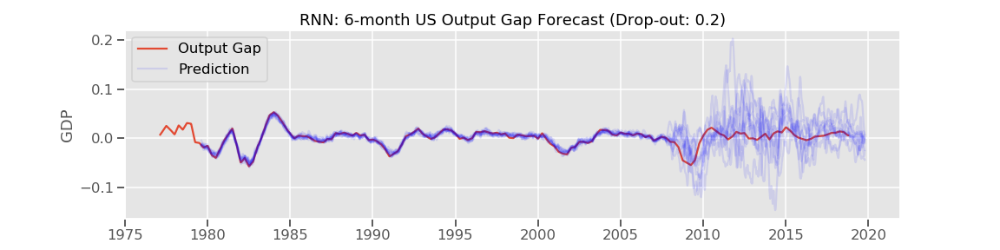
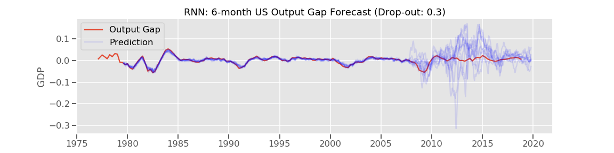
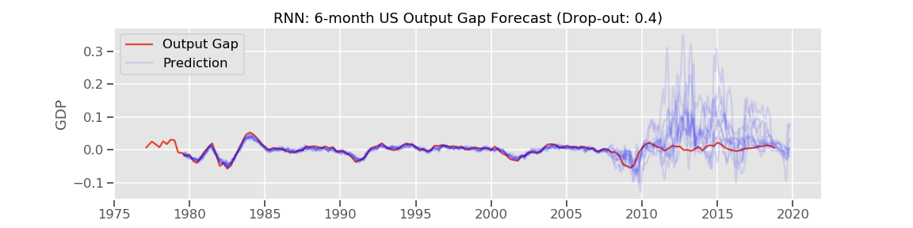
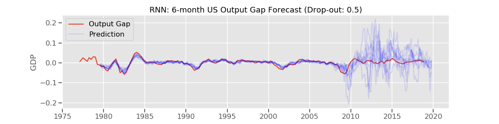
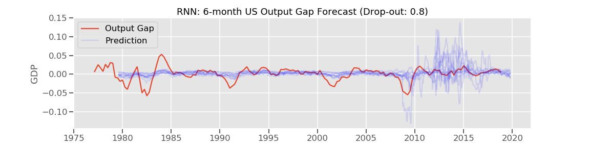

# US Output Gap Forecast

## Contributor
Keita Miyaki

## Goal
This project aims to develop a model to accurately forecast GDP gap of the US economy using machine learning and deep learning techniques.

## Data
Macroeconomic and financial data from FRED since kate 1970's, up/downsampled to weekly frequency for data not in weekly frequency.

## Current status
Recurrent neural network model was developed and is being tuned. It overfits and also predictions fluctuate, so those issues should be addressed.

Initially I thought increasing epochs would help to manage fluctuations but it hasn't worked well so far. Increasing drop-out rate might address overfitting? Or is this an impossible mission?

## Current code

I'm using 52 timesteps (i.e. one year). Data is processed through PCA (30 top principal components are used). Train data also includes output gap at the time and its shape is (1469, 52, 31). Target is output gap of 6 month forward.

```
        regressor = Sequential()

        regressor.add(LSTM(units = 50, return_sequences = True, input_shape = (X_train_rnn.shape[1], X_train_rnn.shape[2])))
        regressor.add(Dropout(drop_out))

        regressor.add(LSTM(units = 50, return_sequences = True))
        regressor.add(Dropout(drop_out))

        regressor.add(LSTM(units = 50, return_sequences = True))
        regressor.add(Dropout(drop_out))

        regressor.add(LSTM(units = 50))
        regressor.add(Dropout(drop_out))

        regressor.add(Dense(units = 1))

        regressor.compile(optimizer = 'adam', loss = 'mean_squared_error')

        regressor.fit(X_train_g_rnn, 
                  y_train_g_rnn, 
                  epochs=50, 
                  batch_size=32)
```

### Trials of 10 times for each drop-out rate









