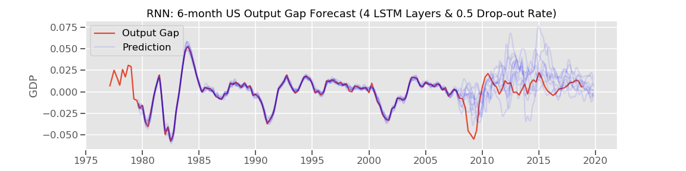
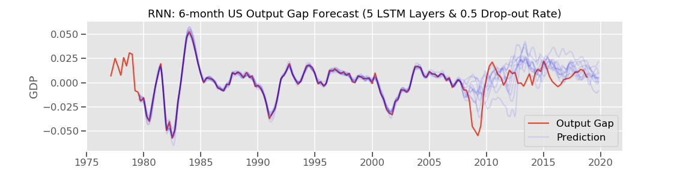
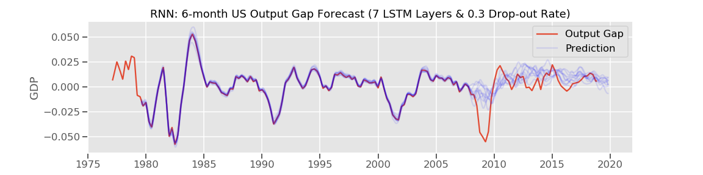
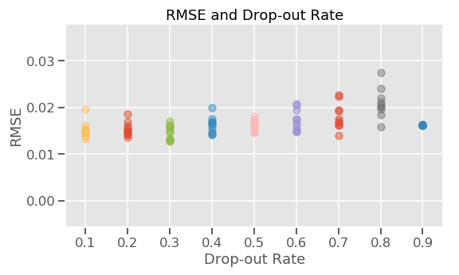

# US Output Gap Forecast

## Contributor
Keita Miyaki

## Goal
This project aims to develop a model to accurately forecast GDP gap of the US economy using machine learning and deep learning techniques.

## Data
Macroeconomic and financial data from FRED since kate 1970's, up/downsampled to weekly frequency for data not in weekly frequency.

## Current status
Recurrent neural network model was developed and is being tuned. It overfits. This may be the best we could do with simple RNN with limited data (only 2100 weeks of data are available for the period of time, of which 1500 were assigned to training and 600 were for test).

Fluctuation of predictions could be addressed by adding LSTM layers (instead of reducing).

## Current code

I'm using 52 timesteps (i.e. one year). Data is processed through PCA (30 top principal components are used). Train data also includes output gap at the time and its shape is (1469, 52, 31). Target is output gap of 6 month forward.

```
        regressor = Sequential()

        regressor.add(LSTM(units=50, return_sequences=True, input_shape=(X_train_rnn.shape[1], X_train_rnn.shape[2])))
        regressor.add(Dropout(drop_out))

        regressor.add(LSTM(units=50, return_sequences=True))
        regressor.add(Dropout(drop_out))

        regressor.add(LSTM(units=50, return_sequences=True))
        regressor.add(Dropout(drop_out))

        regressor.add(LSTM(units=50))
        regressor.add(Dropout(drop_out))

        regressor.add(Dense(units=1))

        regressor.compile(optimizer='adam', loss='mean_squared_error')

        regressor.fit(X_train_g_rnn, 
                      y_train_g_rnn, 
                      epochs=50, 
                      batch_size=50)
```

### Trials of 10 times for different numbers of LSTM layers and drop-out rates

#### Different number of LSTM layers with drop out rate at 0.5






It looks having 6 or more LSTM layers stabilizes the model predictions.

#### LSTM 7 Layers with different drop out rates




#### LSTM 7 Layers, 0.5 drop-out rate, and 100 principal components



Not obvious but drop-out rates around 0.3~0.5 seem better.
